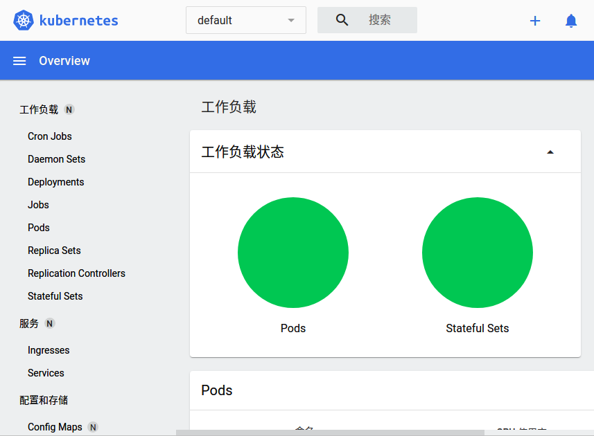

# Try kubenetes with Minikube

> This document will apply to linux host, others would go <https://minikube.sigs.k8s.io/docs/start/> for more documentations.

## Install

First, download and install minikube

```sh
curl -LO https://storage.googleapis.com/minikube/releases/latest/minikube-linux-amd64
sudo install minikube-linux-amd64 /usr/local/bin/minikube
```

## Start

Start a minikube cluster

```sh
minikube start
```


## Kubectl

In minikube, you can use kubectl like:

```sh
minikube kubectl -- get pods -A
```

But you can install and use kubectl as usual:

```sh
curl -LO "https://dl.k8s.io/release/$(curl -L -s https://dl.k8s.io/release/stable.txt)/bin/linux/amd64/kubectl"
sudo install kubectl /usr/local/bin/kubectl
```

Get pods in all namespaces:

```sh
kubectl get pods -A
```

Get storage class:

```sh
kubectl get sc
```

Note that minikube will enable default storage class `standard`, which you should keep in mind.

## Dashboard

Minikube provde dashboard as an extension, start it with:

```sh
minikube dashboard
```

It will open in webbrowser:

